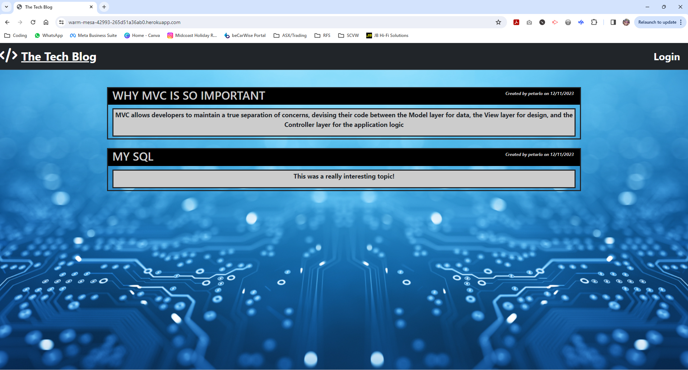

# C14-Tech-Blog

  ## Description
  The aim of this project was to build a CMS-Style blog site that allowed users to publish new blog posts, as well as comment on other users posts.
  The app was required to follow the MVC paradigm and use Handlebars.js as the templating language, Sequelize as the ORM, and the express-session npm package for authentication.
  The finished product was to be deployed via Heroku.

  ## Table of Contents
  * [Description](#description)
  * [Installation](#installation)
  * [Usage](#usage)
  * [Licenses](#licenses)
  * [Contributing](#how-to-contribute)
  * [Tests](#tests)
  * [Questions/Contact Info](#questionscontacts)
  * [Credits](#credits)

  ## Installation
  There is no installation required to run this app but if you would like to use the code locally, use the below steps...
  1. Clone the code from this repository
  2. Open the project in VS Code (or similar) and install npm dependancies
  3. Run db files through mysql before running main code in your terminal
  4. Seed the database

  ## Usage
  Screenshots, GIF and Walkthrough link are below...
  
  
  [Link to deployed page](https://warm-mesa-42993-265d51a36ab0.herokuapp.com/)

  ## Licenses
  This project is covered under the MIT license.
  To learn more about what this means, click the license button at the top.

  ## How to contribute
   Contact me via the details below

  ## Tests
  N/A

  ## Questions/Contacts
  Have questions about this project?  
  GitHub: https://github.com/Petarlo 
  Email: petaswan986@gmail.com  

  ## Credits
  N/A

